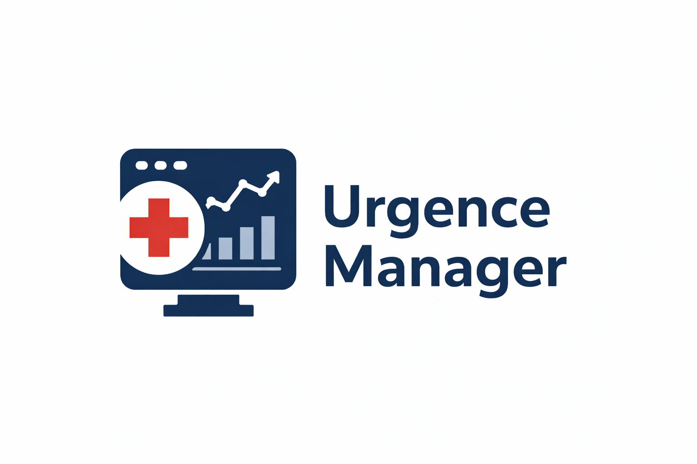
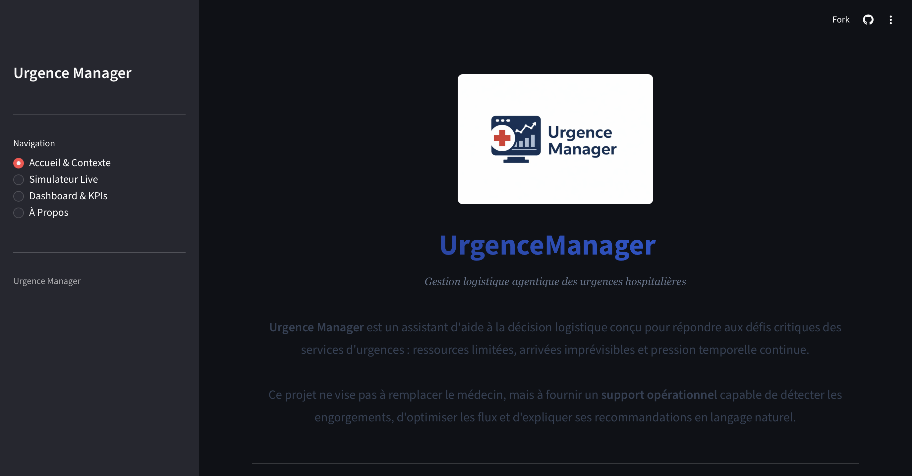
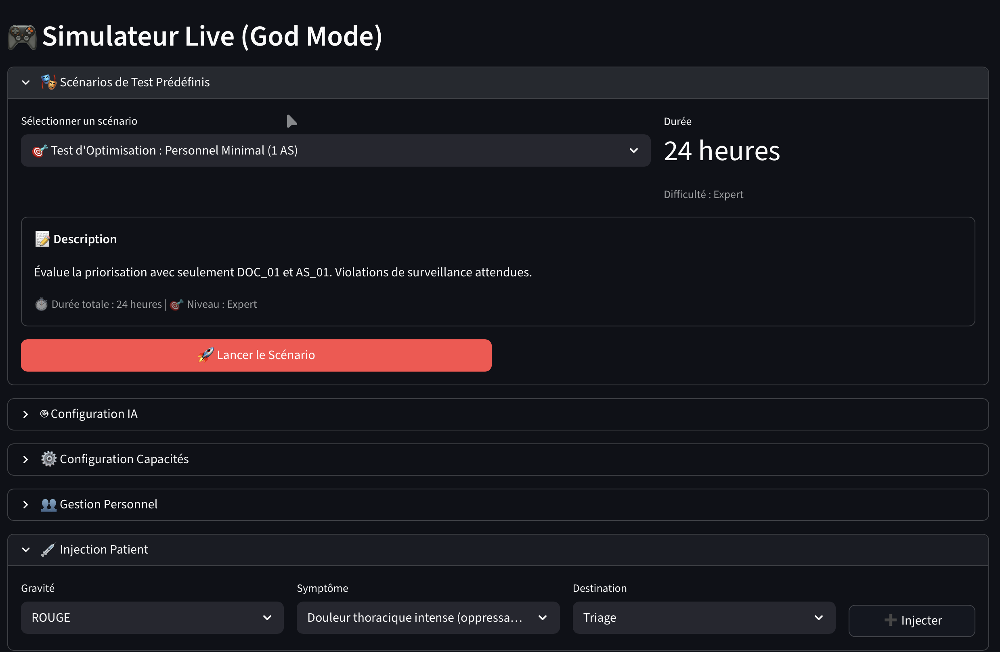
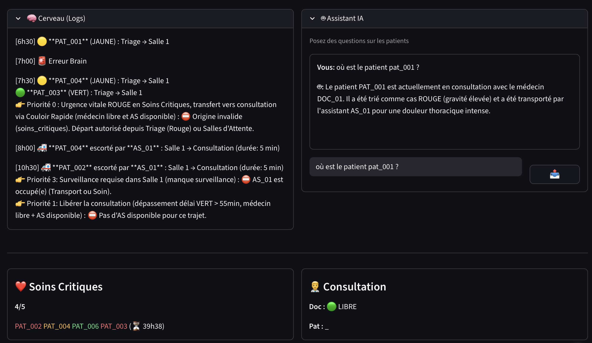
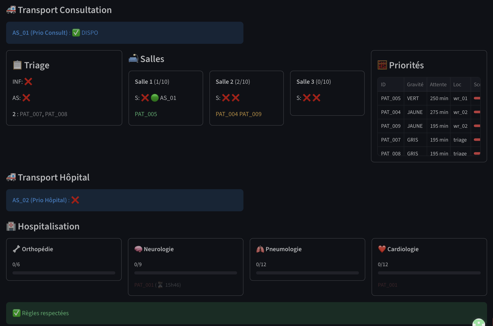
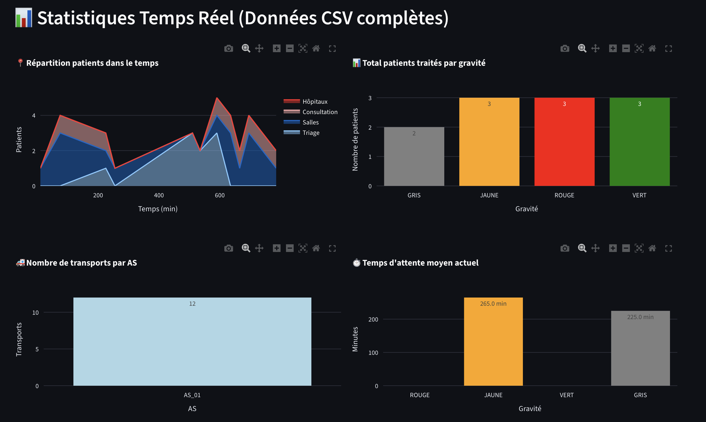
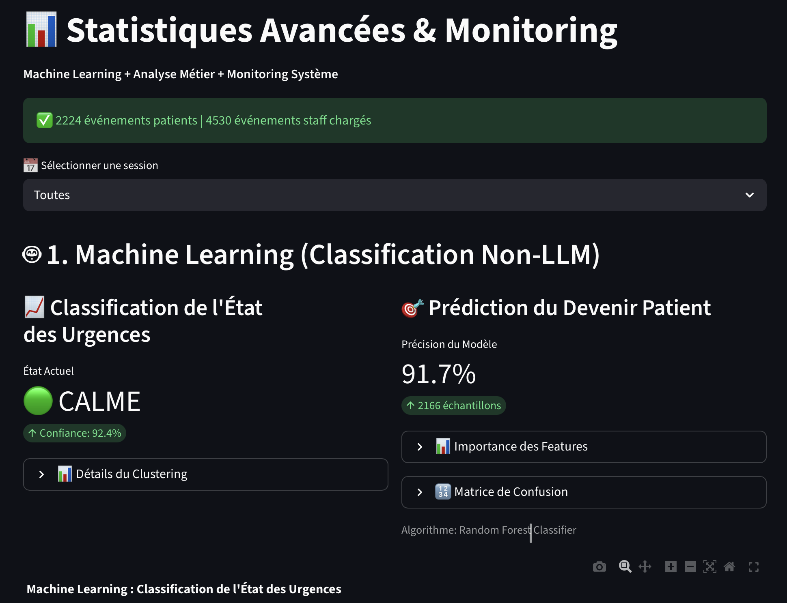
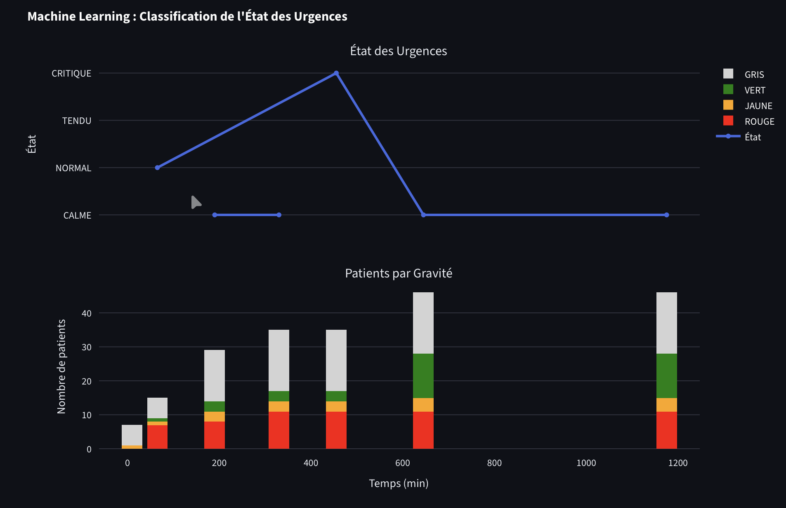
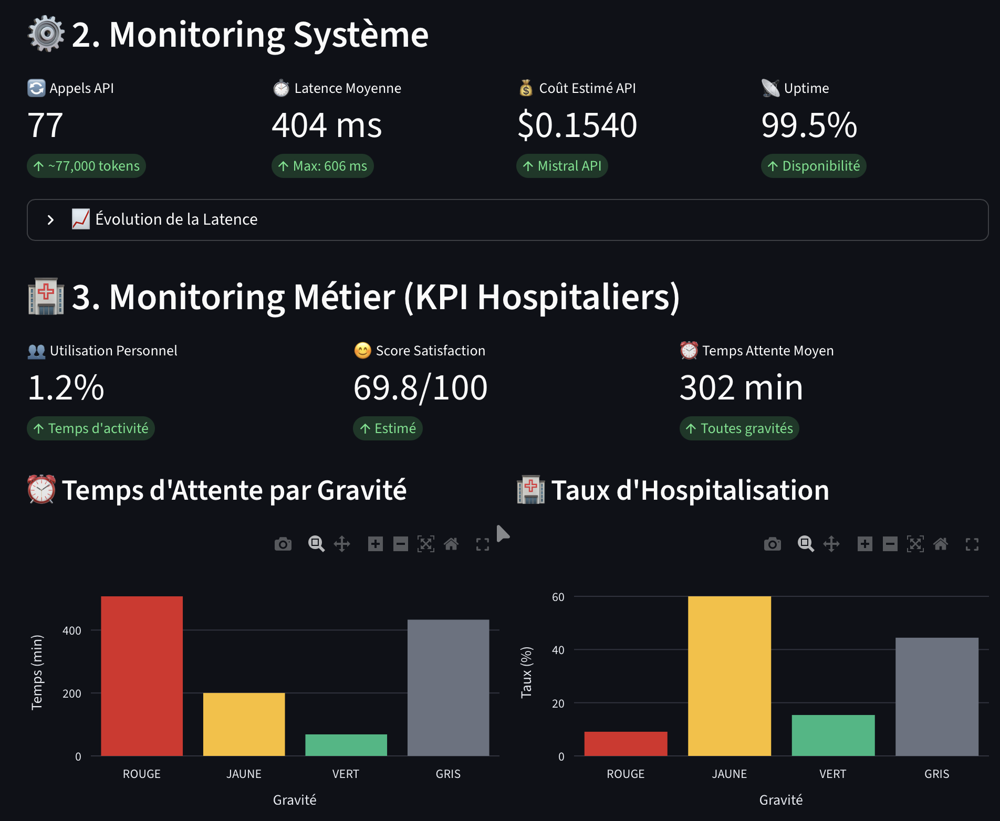
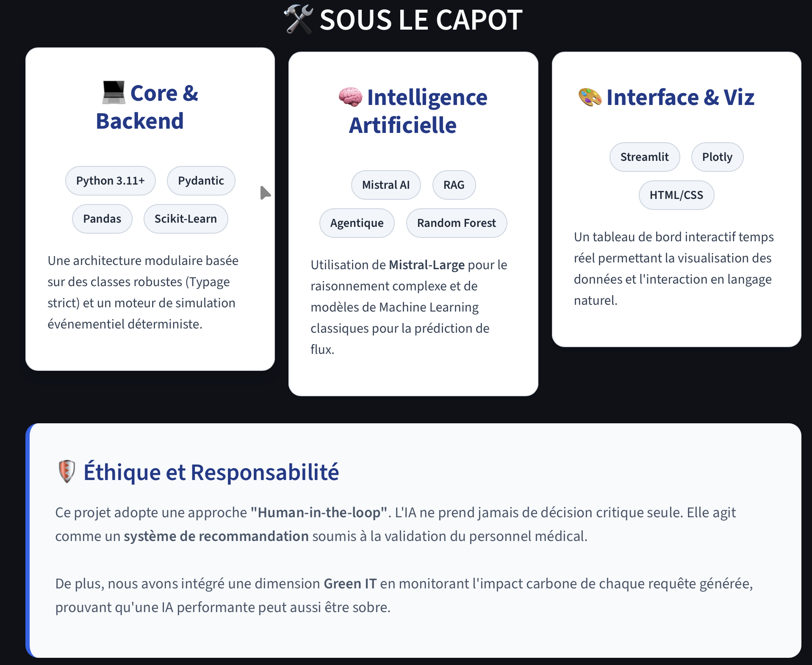

<div align="center">



### *Gestion logistique agentique des urgences hospitalières*

[](https://www.python.org/)
[-purple.svg)]()
[]()
[]()

*Projet de Master 2 SISE – Data Science*  
*Université Lumière Lyon 2 | Année 2025–2026*

[Aperçu](#aperçu) • [Objectifs](#objectifs) • [Points-clés](#points-clés-du-projet) • [Architecture](#architecture-du-système) • [Machine-Learning](#machine-learning) • [LLM, RAG et Agent](#llm-rag-et-agent) • [Simulation & Interface](#simulation--interface)

---

</div>

## Table des matières

- [Aperçu](#aperçu)
- [Objectifs](#objectifs)
- [Points clés du projet](#points-clés-du-projet)
- [Architecture du système](#architecture-du-système)
- [Machine Learning](#machine-learning)
- [LLM, RAG et Agent](#llm-rag-et-agent)
- [Simulation & Interface](#simulation--interface)
- [Métriques & Supervision](#métriques--supervision)
- [Structure du projet](#structure-du-projet)
- [Reproductibilité](#reproductibilité)
- [Limites](#limites)
- [Auteures](#auteures)
- [Licence](#licence)

---

## Aperçu

**Urgence Manager** est un projet académique consacré à la **gestion logistique et opérationnelle des flux de patients dans un service d'urgences hospitalières**, à l'aide d'une **architecture à base de règles**, complétée par :

- des méthodes de **machine learning**,
- des **modèles de langage (LLM)**,
- un pipeline de **Retrieval-Augmented Generation (RAG)**,
- et une **simulation interactive**.

Les services d'urgences sont soumis à de fortes contraintes :
ressources limitées, arrivées imprévisibles, niveaux de gravité hétérogènes, pression temporelle continue et dépendances aval (hospitalisation).

L'objectif de ce projet est de concevoir un **assistant d'aide à la décision logistique**, capable de :

- suivre l'état global d'un service d'urgences,
- gérer les flux de patients et l'allocation des ressources,
- détecter les situations critiques ou anormales,
- **expliquer** les décisions et priorisations en langage naturel.

Le système est conçu comme un **outil de support**, et non comme un substitut au jugement médical humain.

---

## Objectifs

Le projet s'articule autour de trois objectifs complémentaires.

### 1. Gestion logistique des flux

- Modélisation explicite du parcours patient
- Gestion de ressources limitées (salles, personnel, unités)
- Détection des engorgements et goulets d'étranglement
- Respect strict des contraintes organisationnelles et médicales

### 2. Aide à la décision et explicabilité

- Analyse de l'état courant du service
- Interaction avec le système en langage naturel
- Explication des priorités, blocages et risques identifiés
- Traçabilité complète des décisions et événements

### 3. IA responsable et sobre

- Priorité aux règles métier lorsque possible
- Utilisation ciblée du machine learning
- Usage contrôlé et justifié des LLM
- Séparation stricte entre **analyse** et **action**

---

## Points clés du projet

- Modélisation explicite d'un service d'urgences sous forme d'état global
- Moteur de règles déterministe indépendant de toute IA
- Séparation claire entre :
  - logique métier,
  - machine learning,
  - raisonnement et explication via LLM
- Trois briques de machine learning complémentaires
- Pipeline RAG fondé sur des règles explicites et des données factuelles
- Distinction stricte entre **RAG (analyse)** et **Agent (action)**
- Interface interactive de simulation et de supervision
- Accent fort mis sur l'explicabilité et la reproductibilité

---

## Architecture du système

Le système repose sur un **moteur central de simulation et de règles**, qui constitue la source de vérité du projet.

- État global persistant (patients, personnel, salles, temps)
- Règles métier explicites (priorités, capacités, mouvements)
- Simulation du temps et des ressources
- Journalisation complète des événements

Les briques ML, RAG et Agent **ne contournent jamais ce moteur**.

Une description détaillée du modèle sans IA est fournie dans :

```
docs/system_model.md
```

---

## Machine Learning

Cette brique constitue l'intelligence prédictive de l'Urgence Manager. Elle combine deux approches complémentaires pour transformer les données brutes de simulation en outils d'aide à la décision.

### 1. Classification de l'état des urgences (K-means)

- **Algorithme** : Clustering non supervisé (K-Means).

- **Fonctionnement** : Le modèle regroupe les états du système en 4 classes de tension : CALME, NORMAL, TENDU, CRITIQUE.

- **Utilité** : Permet de déclencher des alertes automatiques (ex: passage en état "CRITIQUE") basées sur la saturation des salles d'attente et des unités aval.

### 2. Prédiction du devenir patient (Random Forest)

Ce modèle prédit l'issue du parcours de chaque patient dès son admission, facilitant l'anticipation des besoins en lits.

- **Algorithme** : Random Forest Classifier.

- **Performance** : Précision de 90.1% sur un échantillon de 2459 patients.

- **Features Importance** : Le modèle s'appuie principalement sur trois variables clés : Temps (durée de prise en charge), Gravité (score IOA), Nb Transports (mouvements logistiques internes)

---

## LLM, RAG et Agent

Les modèles de langage sont utilisés **de manière strictement encadrée**.

### RAG (Retrieval-Augmented Generation)

- Accès en lecture seule à :
  - l'état courant,
  - l'historique des événements,
  - les règles explicites.
- Utilisé uniquement pour :
  - l'analyse,
  - l'explication,
  - la recommandation.

Le LLM **ne modifie jamais l'état du système** en mode RAG.

### Agent

- Mode distinct et explicitement séparé
- Capable de proposer et d'orchestrer des actions parmi des outils atomiques, sous validation explicite
- Strictement contraint par les règles métier
- Utilisé pour le pilotage expérimental du système

👉 **Analyse ≠ Action** : cette séparation est un principe fondamental du projet.

---

## Simulation & Interface

Une interface web interactive permet de :

- injecter des patients avec différents niveaux de gravité,
- observer l'évolution en temps réel du service,
- déplacer ressources et patients selon les règles,
- interagir avec le système via un chat explicatif,
- rejouer des scénarios prédéfinis.

### Application en ligne

Une version déployée de l'application est accessible en ligne à l'adresse suivante :

[UrgenceManager](https://urgencemanager-7puxneqxo5jsbeuayzjbey.streamlit.app/)

Elle permet de lancer des simulations, d'observer l'évolution du système en temps réel et d'interagir avec le moteur via l'interface de chat.

⚠️ L’application est fournie à des fins de démonstration et peut être sujette à des interruptions.

### Aperçu visuel de l’application

#### Page d’accueil

<p align="center">
  
</p>

---

#### Simulation en temps réel

<p align="center">
  
  <br/>
  
  <br/>
  
  <br/>
  
</p>

---

#### Dashboard & supervision

<p align="center">
  
  <br/>
  
  br/>
  
</p>

---

#### À propos – Sous le capot

<p align="center">
  
</p>
---

## Métriques & Supervision

### Métriques métier

- temps d'attente par gravité,
- taux d'occupation des ressources,
- fréquence et durée des congestions,
- situations de boarding.

### Métriques système

- latence des appels LLM,
- nombre d'appels,
- estimation des coûts,
- indicateurs d'impact environnemental (proxies).

---

## Structure du projet

```text
urgence-manager/
│
├── README.md
├── LICENSE
├── requirements.txt
├── app.py                                        # Point d'entrée de l'application
│
├── data/
│    ├── state/
│    │    ├── urgence_initial_state.json          # État initial contrôlé
│    │    ├── urgence_state.json                  # État courant persistant
│    │    └── history_logs.json                   # Historique des événements
│    │
│    ├── historique/
│    │    └── SESSION_*.csv                       # Traces complètes de simulations
│    │
│    └── symptoms.json                            # Données de symptômes (triage)
│
├── docs/                                         # Documentation
│
├── img/
│
└── src/
     ├── models.py                                # Modèles métier (Patient, Staff, Room…)
     ├── tools.py                                 # Actions atomiques (transferts, décisions)
     ├── utils.py                                 # I/O, état, sérialisation
     ├── logger.py                                # Journalisation des événements
     ├── ai_brain.py                              # Interface raisonnement (LLM / RAG)
     │
     └── views/
          ├── context.py                          # Contexte transmis au LLM
          ├── simulation.py                       # Vue simulation
          ├── stats.py                            # Statistiques et supervision
          └── about.py
```

## Reproductibilité

- État initial contrôlé
- Graines aléatoires fixées
- Scénarios reproductibles
- Logs exploitables a posteriori

Le projet est conçu pour être **entièrement reproductible**.

---

## Limites

Ce projet constitue un **prototype académique et pédagogique** :

- Il ne pose aucun diagnostic médical,
- Il ne remplace pas les professionnels de santé,
- Il ne revendique aucune validité clinique.

---

## Auteures

Lamia HATEM • Maissa LAJIMI • Aya MECHERI • Rina RAZAFIMAHEFA • Mazilda Zehraoui

---

## Licence

Projet développé dans un cadre académique.  
Usage éducatif et de recherche uniquement.

---

<div align="center">

**Urgence Manager — Gestion logistique agentique des urgences hospitalières**

</div>
