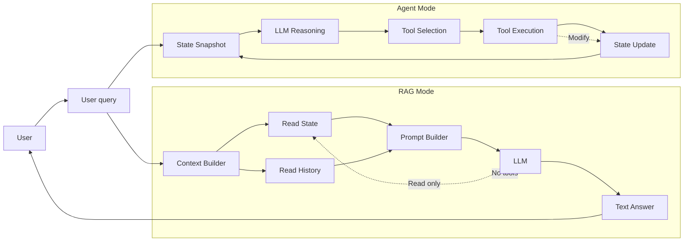

# Agent vs RAG

## 1. Différence conceptuelle : Agent vs RAG

Le projet distingue explicitement deux modes d’utilisation d’un LLM, avec des rôles, des capacités et des risques très différents.

### 1.1. Modèle RAG (Retrieval-Augmented Generation)

#### Rôle
Le LLM agit comme un **analyste en lecture seule**. Il est utilisé pour :
- analyser l’état courant du système
- interpréter l’historique des événements
- expliquer des situations complexes
- formuler des recommandations argumentées

#### Capacités
- lecture de l’état global (patients, personnel, salles)
- lecture de l’historique (CSV, logs)
- génération de texte structuré

#### Limitations
- aucune action possible
- aucun appel d’outil
- aucune modification de l’état
- aucune boucle décisionnelle

Le RAG est utilisé pour l’explicabilité, la supervision et l’aide à la décision, jamais pour l’exécution.

### 1.2. Mode Agent

#### Rôle
Le LLM agit comme un agent opérationnel, capable de piloter le système. Il est utilisé pour :
- sélectionner des actions
- appeler des outils atomiques
- modifier l’état du système
- enchaîner des décisions dans le temps

#### Capacités
- accès à un snapshot de l’état
- raisonnement décisionnel
- sélection d’actions parmi un ensemble borné
- boucle perception → action → nouvel état

#### Risques
- dérive agentive
- accumulation d’erreurs
- décisions médicalement incorrectes si mal contraint

### 1.3. Principe fondamental du projet

> Analyse ≠ Action

- RAG → comprendre, expliquer, recommander
- Agent → agir, déplacer, modifier

## 2. Brique RAG

### 2.1. Objectif du RAG

La brique RAG vise à permettre au LLM de :
- raisonner sur un système dynamique
- s’appuyer sur des données factuelles
- éviter toute hallucination structurelle

Le RAG n’est pas un moteur de décision, mais un moteur d’analyse contextualisée.

### 2.2. Sources de connaissance injectées

Le contexte fourni au LLM est construit à partir de l’état courant du système (JSON), de l’historique des patients et du personnel (CSV) et des règles métier explicitement rappelées dans le prompt.

Les règles ne sont pas déduites par le LLM : elles sont injectées explicitement pour éviter toute interprétation erronée.

### 2.3. Sélection de contexte

Avant d’être injectées dans le prompt, les données sont filtrées, résumées et hiérarchisées.

Objectifs :
- limiter la taille du contexte
- éviter le bruit
- focaliser l’analyse sur les éléments critiques (patients ROUGE, dépassements, blocages)

Le RAG n’est donc pas un simple concaténateur de texte, mais un pipeline de sélection de contexte.

