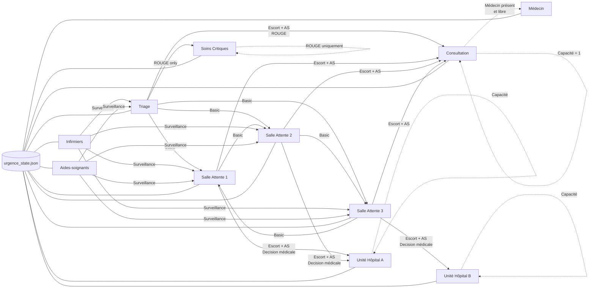

### Diagramme opérationnel du système

Ce diagramme représente :
- l’état global
- les entités principales
- les 3 types de transferts
- les contrôles critiques (sévérité, ressources, capacité)

Tout est relié à l’état JSON → aucune action n’est locale.

##### Légende

**Flèches pleines** : flux patients  
**Flèches pointillées** : contraintes métier  
**Basic** : `transfer_patient_basic`  
**Escort + AS** : `transfer_patient_with_escort`  
**Surveillance** : `transfer_staff`  

