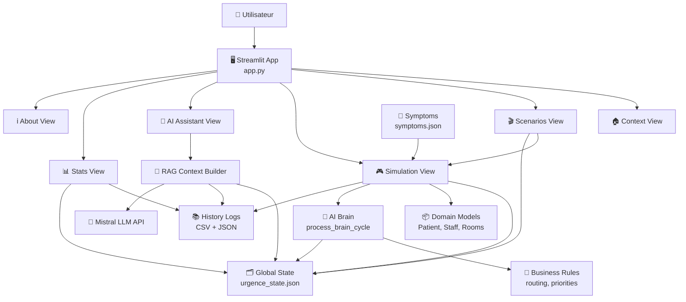

```mermaid
flowchart TD
    %% --- Frontend ---
    User[👤 Utilisateur]
    Streamlit[🖥️ Streamlit App<br/>app.py]

    %% --- Views ---
    Context[🏠 Context View]
    Scenarios[🎬 Scenarios View]
    Simulation[🎮 Simulation View]
    Chat[💬 AI Assistant View]
    Stats[📊 Stats View]
    About[ℹ️ About View]

    %% --- Core Logic ---
    Brain[🧠 AI Brain<br/>process_brain_cycle]
    Rules[📏 Business Rules<br/>routing, priorities]
    Models[📦 Domain Models<br/>Patient, Staff, Rooms]

    %% --- State & Data ---
    State[🗂️ Global State<br/>urgence_state.json]
    History[📚 History Logs<br/>CSV + JSON]
    Symptoms[🧾 Symptoms<br/>symptoms.json]

    %% --- RAG / LLM ---
    RAG[🔎 RAG Context Builder]
    LLM[🤖 Mistral LLM API]

    %% --- Flows ---
    User --> Streamlit

    Streamlit --> Context
    Streamlit --> Scenarios
    Streamlit --> Simulation
    Streamlit --> Chat
    Streamlit --> Stats
    Streamlit --> About

    Simulation --> State
    Simulation --> Models
    Simulation --> Brain
    Brain --> Rules
    Brain --> State

    Scenarios --> Simulation
    Scenarios --> State

    Stats --> History
    Stats --> State

    Chat --> RAG
    RAG --> State
    RAG --> History
    RAG --> LLM

    Simulation --> History
    Symptoms --> Simulation
```
