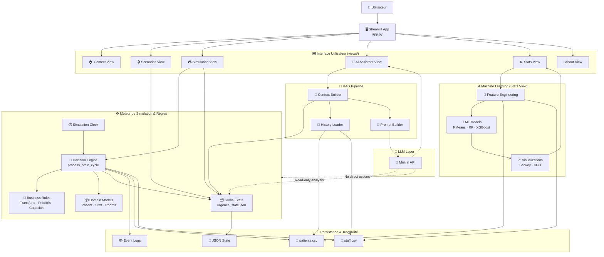

```mermaid
flowchart TB
    %% =========================================================
    %% USER & APP
    %% =========================================================
    User[👤 Utilisateur]
    App[🖥️ Streamlit App<br/>app.py]

    User --> App

    %% =========================================================
    %% UI VIEWS
    %% =========================================================
    subgraph UI["🎛️ Interface Utilisateur (views/)"]
        Context[🏠 Context View]
        Scenarios[🎬 Scenarios View]
        SimulationUI[🎮 Simulation View]
        ChatUI[💬 AI Assistant View]
        StatsUI[📊 Stats View]
        About[ℹ️ About View]
    end

    App --> Context
    App --> Scenarios
    App --> SimulationUI
    App --> ChatUI
    App --> StatsUI
    App --> About

    %% =========================================================
    %% CORE ENGINE
    %% =========================================================
    subgraph Engine["⚙️ Moteur de Simulation & Règles"]
        State[🗂️ Global State<br/>urgence_state.json]
        Models[📦 Domain Models<br/>Patient · Staff · Rooms]
        Rules[📏 Business Rules<br/>Transferts · Priorités · Capacités]
        Clock[⏱️ Simulation Clock]
        Brain[🧠 Decision Engine<br/>process_brain_cycle]
    end

    SimulationUI --> Brain
    Brain --> Rules
    Brain --> Models
    Brain --> State
    Clock --> Brain

    Scenarios --> State
    SimulationUI --> State

    %% =========================================================
    %% PERSISTENCE & LOGGING
    %% =========================================================
    subgraph Persistence["💾 Persistance & Traçabilité"]
        JSONState[📄 JSON State]
        Logs[📚 Event Logs]
        CSVPatients[📑 patients.csv]
        CSVStaff[📑 staff.csv]
    end

    State --> JSONState
    Brain --> Logs
    Brain --> CSVPatients
    Brain --> CSVStaff

    %% =========================================================
    %% RAG PIPELINE
    %% =========================================================
    subgraph RAG["🔎 RAG Pipeline"]
        ContextBuilder[🧩 Context Builder]
        HistoryLoader[📖 History Loader]
        PromptBuilder[📝 Prompt Builder]
    end

    ChatUI --> ContextBuilder
    ContextBuilder --> State
    ContextBuilder --> HistoryLoader
    HistoryLoader --> CSVPatients
    HistoryLoader --> CSVStaff
    ContextBuilder --> PromptBuilder

    %% =========================================================
    %% LLM
    %% =========================================================
    subgraph LLM["🤖 LLM Layer"]
        Mistral[🧠 Mistral API]
    end

    PromptBuilder --> Mistral
    Mistral --> ChatUI

    %% =========================================================
    %% ML CLASSIC
    %% =========================================================
    subgraph ML["📊 Machine Learning (Stats View)"]
        Features[🧮 Feature Engineering]
        ModelsML[🤖 ML Models<br/>KMeans · RF · XGBoost]
        Viz[📈 Visualizations<br/>Sankey · KPIs]
    end

    StatsUI --> Features
    Features --> ModelsML
    ModelsML --> Viz
    Features --> CSVPatients
    Features --> CSVStaff
    Viz --> StatsUI

    %% =========================================================
    %% CONSTRAINTS & PHILOSOPHY
    %% =========================================================
    Mistral -.->|Read-only analysis| State
    Mistral -.->|No direct actions| Engine
```

