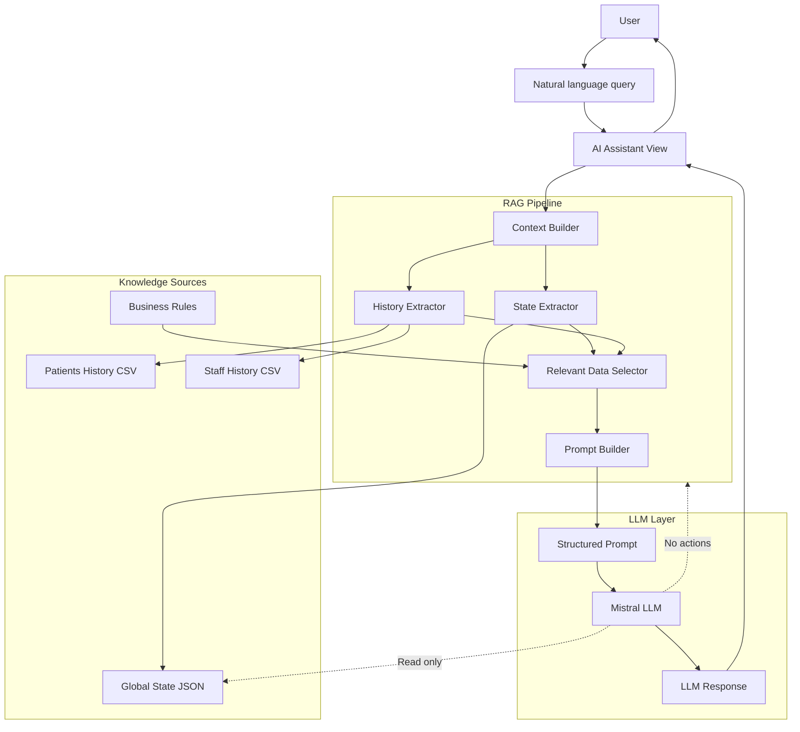

# Pipeline RAG

La brique RAG permet au LLM d'analyser l’état courant et l'historique du système via un pipeline de sélection de contexte. Le modèle est strictement en lecture seule et ne dispose d'aucun accès actionnable au moteur de simulation.

### Entrée

L'utilisateur pose une **question libre**, sans accès direct aux données.

### Context Builder

Il orchestre:
- l'extraction de l’état courant
- l'extraction de l’historique
- la sélection des éléments pertinents

Ce n’est pas un simple concat, mais un filtrage sémantique orienté décision.

### Sources de connaissance

Le RAG s’appuie sur :
- 🗂️ état courant (temps réel)
- 📑 historique CSV (trajectoires)
- 📘 règles métier implicites (codées dans le moteur, rappelées au LLM)

⚠️ les règles ne sont pas re-découvertes, elles sont injectées explicitement.

### Sélecteur de pertinence

Son rôle est d'éviter la surcharge de contexte, et de ne garder que :
- patients critiques,
- alertes,
- tendances,
- violations potentielles,
rendant ainsi le RAG efficace et stable.

### Proompt structuré

Le prompt contient 3 couches claires :
- System prompt (rôle, limites, ton),
- Contexte factuel (état + historique),
- Question utilisateur.
Le LLM n'infère pas l’état, il le lit.

### Garanties de sécurité
Le LLM est un observateur expert, pas un acteur :
- ❌ Pas de tool calling
- ❌ Pas de modification d’état
- ❌ Pas de boucle agentive
- ✅ Analyse, explication, recommandation uniquement

