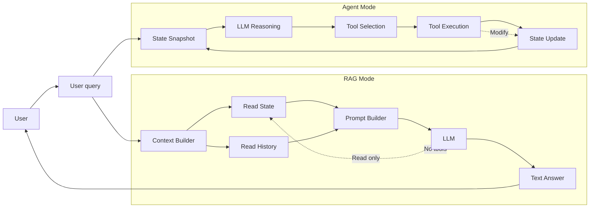

# Agent vs RAG

Le RAG est utilisé pour l’analyse et l’explicabilité.  
L’agent est réservé au pilotage opérationnel et est strictement contraint par des outils atomiques.

```mermaid
flowchart LR
    %% USER
    User[User]
    Query[User query]

    User --> Query

    %% =========================
    %% RAG PATH
    %% =========================
    subgraph RAG[RAG Mode]
        RAGContext[Context Builder]
        RAGState[Read State]
        RAGHistory[Read History]
        RAGPrompt[Prompt Builder]
        RAGModel[LLM]
        RAGAnswer[Text Answer]
    end

    Query --> RAGContext
    RAGContext --> RAGState
    RAGContext --> RAGHistory
    RAGState --> RAGPrompt
    RAGHistory --> RAGPrompt
    RAGPrompt --> RAGModel
    RAGModel --> RAGAnswer
    RAGAnswer --> User

    %% =========================
    %% AGENT PATH
    %% =========================
    subgraph Agent[Agent Mode]
        AgentContext[State Snapshot]
        AgentReasoning[LLM Reasoning]
        ToolSelect[Tool Selection]
        ToolCall[Tool Execution]
        StateUpdate[State Update]
    end

    Query --> AgentContext
    AgentContext --> AgentReasoning
    AgentReasoning --> ToolSelect
    ToolSelect --> ToolCall
    ToolCall --> StateUpdate
    StateUpdate --> AgentContext

    %% =========================
    %% CONSTRAINTS
    %% =========================
    RAGModel -.->|Read only| RAGState
    RAGModel -.->|No tools| RAG

    ToolCall -.->|Modify| StateUpdate

```

